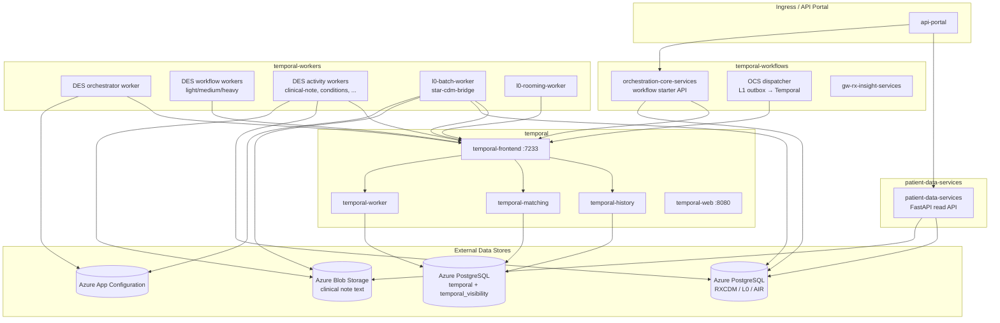
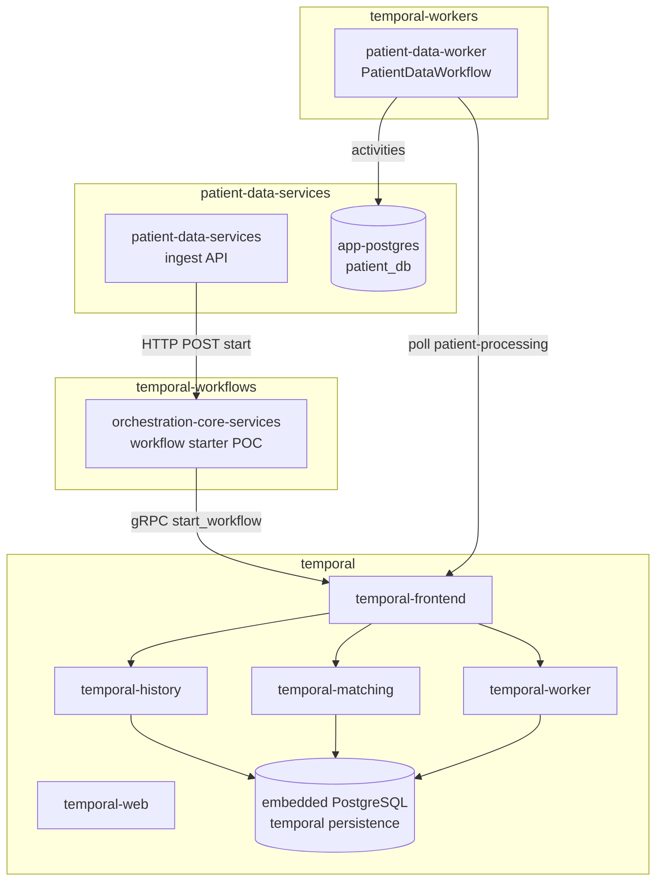

# Architecture — Discovered AKS vs Local Kind POC

## Discovered AKS Logical Architecture

## Local Kind POC Architecture

## Namespace Mapping

| AKS Namespace | AKS Role | Local POC Equivalent |
|---------------|----------|----------------------|
| patient-data-services | Patient clinical REST API + PG | Simplified ingest API + app-postgres |
| temporal | Temporal server cluster | Helm Temporal + embedded PG |
| temporal-workers | DES + L0 + batch workers | Single `patient-data-worker` |
| temporal-workflows | OCS workflow starter + insight | Workflow starter service (OCS analogue) |

## What Changed Locally (ASSUMPTIONS)

1. **Single workflow** `PatientDataWorkflow` replaces `ProcessPatientDataWorkflow` + 10+ formatter child workflows.
2. **Direct ingest** endpoint replaces multi-hop L0 sync → outbox → dispatcher chain for demo purposes.
3. **No Azure** App Config, Blob, Key Vault, or Managed Identity.
4. **One worker deployment** instead of KEDA-scaled role-specific DES/L0 fleets.

## What Cannot Be Replicated

- Full DES formatter fan-out (appointments, medications, clinical notes, etc.)
- KEDA autoscaling on Temporal task queue depth
- Azure Files Temporal archival (`file://` on RWX PVC)
- Istio sidecars (2/2 containers in AKS pods)
- Production search attributes (`RxPatientId`, `DataPackageId`) — local uses basic workflow IDs only
